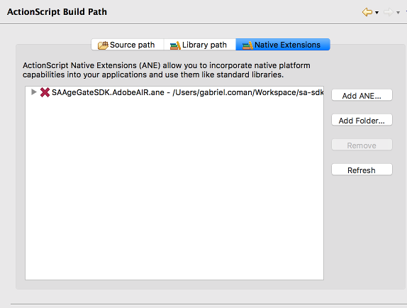

Add the SDK
===========

The Adobe AIR Age Gate SDK is built as an AIR Native Extension in order to work together with the Android and iOS native SDKs
so that you can harness the full power of native components for a better overall experience.

To begin integrating the SDK:

1) Download the latest version of the full Adobe AIR Age Gate SDK: `SAAgeGateSDK-<sdk_version>.AdobeAIR.ane <https://github.com/SuperAwesomeLTD/sa-sdk-build-repo/blob/master/package/ag_air/<sdk_version>/SAAgeGateSDK-<sdk_version>.AdobeAIR.ane?raw=true>`_ .

2) Right-click on your project in the *Package Explorer* and select *Properties* :

.. image:: img/IMG_02_Add_ANE_1.png
    :height: 500px
    :align: center

3) Then go to *ActionScript Build Path* and then to the *Native Extensions* tab.

4) Lastly you'll want to add the .ane file you just downloaded by clicking on the *Add ANE* button.

If you follow all these steps the SDK will be installed as a Native Extension.
There are however a couple of additional steps to do for either the Android or iOS build.

Setup for Android builds
------------------------

When building your Adobe AIR app as an Android application, you'll often want to change the associated XML file that AIR generates
alongside your project to add or change different parameters to make it suitable for deploying on Android.
Using this SDK is no exception, and you'll have to add the following lines to the Android / Manifest Additions part of the xml file.

.. code-block:: xml

    <android>
    <manifestAdditions><![CDATA[
        <manifest android:installLocation="auto">
            <application android:allowBackup="true">

              <activity android:name="tv.superawesome.sdk.agegate.SAAgeGate"
                        android:label="SAAgeGate"
                        android:configChanges="keyboardHidden|orientation|screenSize"
                        android:theme="@android:style/Theme.Holo.Dialog.NoActionBar"
                        android:excludeFromRecents="true"/>

              <activity android:name="tv.superawesome.sdk.agegate.SAAgeInput"
                        android:theme="@android:style/Theme.Translucent.NoTitleBar"/>

            </application>
        </manifest>
    ]]></manifestAdditions>
    <containsVideo>true</containsVideo>
    </android>

Setup for iOS builds
--------------------

There are no additional steps to take when it comes to the iOS build, but you must know that the native component of the SDK will only work for **iOS 8.0+** builds.

Finally
-------

Once you've integrated the Adobe AIR Age Gate SDK, you can access all functionality by including the following:

.. code-block:: actionscript

    import tv.superawesome.sdk.agegate.*;
